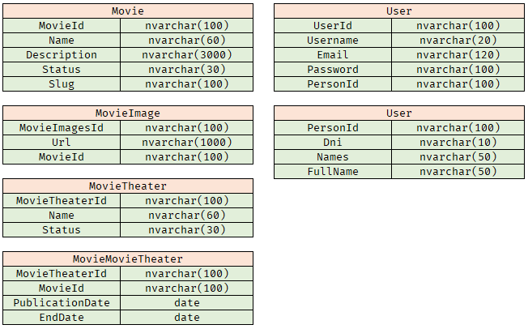

# Viamatica-CineHub-Backend

  

**¡Por favor levantar docker-compose, agregar el seeding de la carpeta de la raíz para rellenar la base de datos. Y registrarse primero con el endpoint register para el respectivo logueo!**

**Web Server** (Backend) de mi prueba técnica, usando un enfoque profesional basado en arquitectura limpia, DDD, código limpio, patrones de diseño y principios de código en el servidor.

